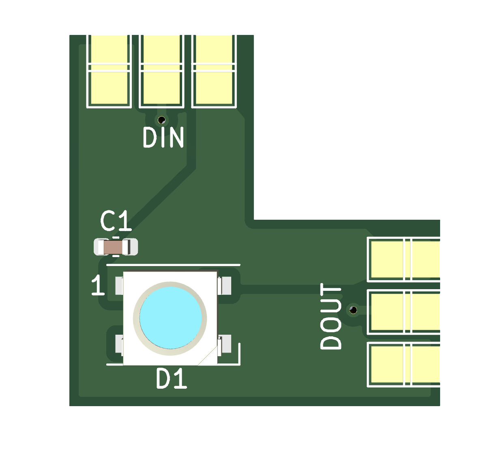

# 3-pin digital LED corner PCB

Created with KiCad
 
## Current status: Designed 
 
## Features

- Onboard Digital LED
	- can be skipped by bridging the solderpoints	

## The Hardware:

## Contributions

Feel free to open Pull Requests here
